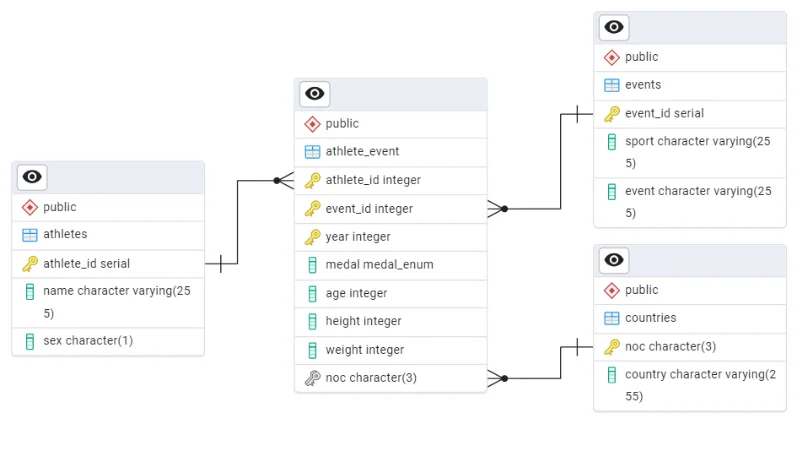

# olympic-data-analytics
Business Intelligence &amp; Data Analytics case study analyzing historical Olympic Games data for news media and athletic performance coaches
## 🗄️ SQL & Relational Database Management

The processed datasets were loaded into a **PostgreSQL 18** relational database to enable structured data analysis and query optimization.

### 📐 Database Schema Overview
 
The relational structure consists of four main entities:
* **`Athletes`**: Stores unique athlete profiles (`athlete_id`, `name`, `sex`).
* **`NOC_Regions`**: Maps National Olympic Committee codes to region names (`noc`, `region_name`).
* **`Events`**: Contains sport categories and specific Olympic events (`event_id`, `sport`, `event_name`).
* **`Athlete_Events`**: Fact table linking athletes, events, and NOC regions with performance details (`participation_id`, `year`, `age`, `height_cm`, `weight_kg`, `medal`).

Custom **ENUM** types were created for `medal_enum` ('Gold', 'Silver', 'Bronze', 'No Medal') and `sex_enum` ('M', 'F') to enforce data integrity.

---

### 📊 Key SQL Queries & Analytics

All queries and database initialization scripts are structured under the `/sql` directory:
* `sql/01_schema.sql`: DDL commands for ENUM types, primary keys, and foreign key relationships.
* `sql/02_queries.sql`: Data import (`COPY`) commands and exploratory analytical SQL queries.

#### Sample Analyses Included:
1. **Top 10 All-Time Medal Nations**: Aggregates total medals won by region.
2. **Most Successful Athletes**: Ranks athletes by gold medals and overall medal count.
3. **Physical Profiles by Sport**: Calculates average height and weight per Olympic sport category
